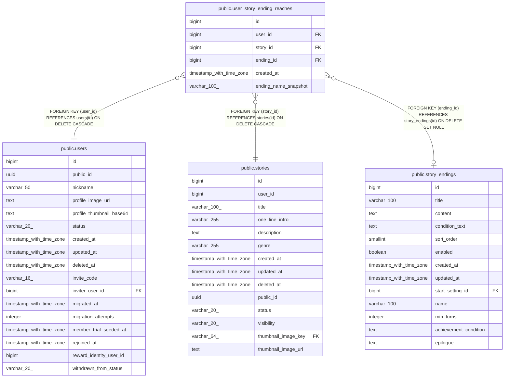

# public.user_story_ending_reaches

## Columns

| Name | Type | Default | Nullable | Children | Parents | Comment |
| ---- | ---- | ------- | -------- | -------- | ------- | ------- |
| id | bigint | nextval('user_story_ending_reaches_id_seq'::regclass) | false |  |  |  |
| user_id | bigint |  | false |  | [public.users](public.users.md) |  |
| story_id | bigint |  | false |  | [public.stories](public.stories.md) |  |
| ending_id | bigint |  | true |  | [public.story_endings](public.story_endings.md) |  |
| created_at | timestamp with time zone | now() | false |  |  |  |
| ending_name_snapshot | varchar(100) |  | true |  |  | KNK-1065: 도달 시점의 엔딩 이름. 다음 릴리스에서 NOT NULL + 유니크 키로 승격한다. ending_id는 엔딩 교체로 비워질 수 있는 보조 참조. |

## Constraints

| Name | Type | Definition |
| ---- | ---- | ---------- |
| fk_user_story_ending_reaches_story | FOREIGN KEY | FOREIGN KEY (story_id) REFERENCES stories(id) ON DELETE CASCADE |
| fk_user_story_ending_reaches_user | FOREIGN KEY | FOREIGN KEY (user_id) REFERENCES users(id) ON DELETE CASCADE |
| fk_user_story_ending_reaches_ending | FOREIGN KEY | FOREIGN KEY (ending_id) REFERENCES story_endings(id) ON DELETE SET NULL |
| user_story_ending_reaches_pkey | PRIMARY KEY | PRIMARY KEY (id) |
| uq_user_story_ending_reaches | UNIQUE | UNIQUE (user_id, story_id, ending_id) |

## Indexes

| Name | Definition |
| ---- | ---------- |
| user_story_ending_reaches_pkey | CREATE UNIQUE INDEX user_story_ending_reaches_pkey ON public.user_story_ending_reaches USING btree (id) |
| uq_user_story_ending_reaches | CREATE UNIQUE INDEX uq_user_story_ending_reaches ON public.user_story_ending_reaches USING btree (user_id, story_id, ending_id) |
| idx_user_story_ending_reaches_user_story | CREATE INDEX idx_user_story_ending_reaches_user_story ON public.user_story_ending_reaches USING btree (user_id, story_id) |

## Relations

```mermaid
erDiagram

"public.user_story_ending_reaches" }o--|| "public.users" : "FOREIGN KEY (user_id) REFERENCES users(id) ON DELETE CASCADE"
"public.user_story_ending_reaches" }o--|| "public.stories" : "FOREIGN KEY (story_id) REFERENCES stories(id) ON DELETE CASCADE"
"public.user_story_ending_reaches" }o--o| "public.story_endings" : "FOREIGN KEY (ending_id) REFERENCES story_endings(id) ON DELETE SET NULL"

"public.user_story_ending_reaches" {
  bigint id
  bigint user_id FK
  bigint story_id FK
  bigint ending_id FK
  timestamp_with_time_zone created_at
  varchar_100_ ending_name_snapshot
}
"public.users" {
  bigint id
  uuid public_id
  varchar_50_ nickname
  text profile_image_url
  text profile_thumbnail_base64
  varchar_20_ status
  timestamp_with_time_zone created_at
  timestamp_with_time_zone updated_at
  timestamp_with_time_zone deleted_at
  varchar_16_ invite_code
  bigint inviter_user_id FK
  timestamp_with_time_zone migrated_at
  integer migration_attempts
  timestamp_with_time_zone member_trial_seeded_at
  timestamp_with_time_zone rejoined_at
  bigint reward_identity_user_id
  varchar_20_ withdrawn_from_status
}
"public.stories" {
  bigint id
  bigint user_id
  varchar_100_ title
  varchar_255_ one_line_intro
  text description
  varchar_255_ genre
  timestamp_with_time_zone created_at
  timestamp_with_time_zone updated_at
  timestamp_with_time_zone deleted_at
  uuid public_id
  varchar_20_ status
  varchar_20_ visibility
  varchar_64_ thumbnail_image_key FK
  text thumbnail_image_url
}
"public.story_endings" {
  bigint id
  varchar_100_ title
  text content
  text condition_text
  smallint sort_order
  boolean enabled
  timestamp_with_time_zone created_at
  timestamp_with_time_zone updated_at
  bigint start_setting_id FK
  varchar_100_ name
  integer min_turns
  text achievement_condition
  text epilogue
}
```

---

> Generated by [tbls](https://github.com/k1LoW/tbls)
