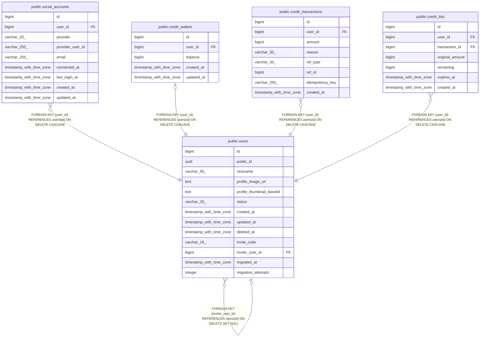

# public.users

## Columns

| Name | Type | Default | Nullable | Children | Parents | Comment |
| ---- | ---- | ------- | -------- | -------- | ------- | ------- |
| id | bigint | nextval('users_id_seq'::regclass) | false | [public.users](public.users.md) [public.social_accounts](public.social_accounts.md) [public.credit_wallets](public.credit_wallets.md) [public.credit_transactions](public.credit_transactions.md) [public.credit_lots](public.credit_lots.md) |  |  |
| public_id | uuid | gen_random_uuid() | false |  |  |  |
| nickname | varchar(50) |  | false |  |  |  |
| profile_image_url | text |  | true |  |  |  |
| profile_thumbnail_base64 | text |  | true |  |  |  |
| status | varchar(20) | 'ACTIVE'::character varying | false |  |  |  |
| created_at | timestamp with time zone | now() | false |  |  |  |
| updated_at | timestamp with time zone | now() | false |  |  |  |
| deleted_at | timestamp with time zone |  | true |  |  |  |
| invite_code | varchar(16) |  | true |  |  |  |
| inviter_user_id | bigint |  | true |  | [public.users](public.users.md) |  |
| migrated_at | timestamp with time zone |  | true |  |  |  |
| migration_attempts | integer | 0 | false |  |  |  |

## Constraints

| Name | Type | Definition |
| ---- | ---- | ---------- |
| ck_users_status | CHECK | CHECK (((status)::text = ANY ((ARRAY['ACTIVE'::character varying, 'SUSPENDED'::character varying, 'DELETED'::character varying])::text[]))) |
| fk_users_inviter_user_id | FOREIGN KEY | FOREIGN KEY (inviter_user_id) REFERENCES users(id) ON DELETE SET NULL |
| users_pkey | PRIMARY KEY | PRIMARY KEY (id) |
| uq_users_public_id | UNIQUE | UNIQUE (public_id) |
| uq_users_invite_code | UNIQUE | UNIQUE (invite_code) |

## Indexes

| Name | Definition |
| ---- | ---------- |
| users_pkey | CREATE UNIQUE INDEX users_pkey ON public.users USING btree (id) |
| uq_users_public_id | CREATE UNIQUE INDEX uq_users_public_id ON public.users USING btree (public_id) |
| uq_users_invite_code | CREATE UNIQUE INDEX uq_users_invite_code ON public.users USING btree (invite_code) |

## Relations

---

> Generated by [tbls](https://github.com/k1LoW/tbls)
